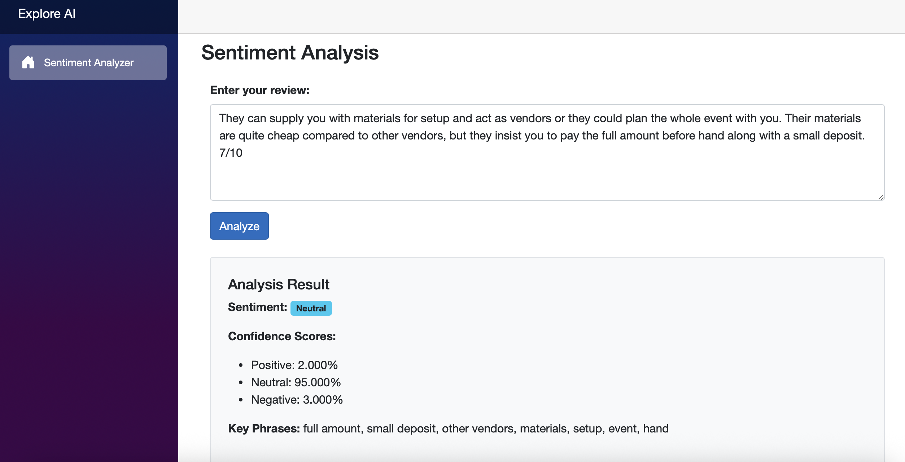

# Sentiment Analysis Web App

A simple .NET + Blazor WebAssembly app that analyzes sentiment using Azure Cognitive Services.

## Features
- Azure Text Analytics API integration
- Blazor frontend
- Custom sentiment report
- CORS secured API

## Tech Stack
- ASP.NET Core (.NET 8)
- Azure Cognitive Services (Language)
- Blazor WebAssembly
- VS Code (Mac)

## Setup
1. Clone the repo
2. Add `appsettings.json` or configure user secrets for Azure credentials
3. Run backend API and Blazor frontend

## Preview

## Preview

